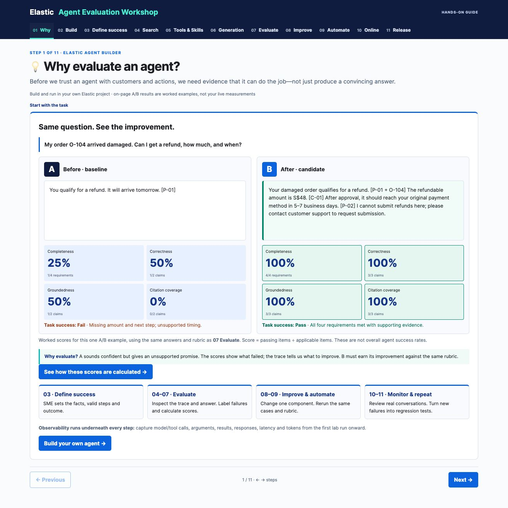

# Elastic Agent Evaluation Workshop

[Open the workshop](https://2gavy.github.io/agent-evals/)

[](https://2gavy.github.io/agent-evals/)

A beginner, hands-on workshop for evaluating agents built with Elastic Agent Builder.

Follow one customer-support example from a baseline answer through evaluation, improvement, automation and online observation. Compare A and B side by side, inspect the evidence and copy the lab commands directly from the website.

## Workshop journey

1. **Why** — compare an incomplete answer with a useful one.
2. **Build** — create an Elastic project, ingest documents and configure the agent and tools.
3. **Golden dataset** — review five starter cases, reference facts, expected trajectories and pass criteria with an SME.
4. **Search** — evaluate retrieval coverage, ranking and query fan-out.
5. **Tools & Skills** — inspect tool arguments, results and the agent trajectory.
6. **Generation** — compare instructions and the resulting answers.
7. **Evaluate** — score completeness, correctness, groundedness and citations.
8. **Improve** — test retrieval, tool configuration, instructions or model changes.
9. **Automate** — use code checks and a calibrated LLM judge; copy the A/B capture runner.
10. **Online** — use conversation traces to identify new failure cases.
11. **Release** — retest, monitor and add regression coverage.

## Publish with GitHub Pages

This repository is a static website. No build, package installation or backend is required.

1. Put these files at the root of the repository's `main` branch.
2. In **Settings → Pages**, select **Deploy from a branch**.
3. Choose **main** and **/ (root)**, then save.
4. Open the published URL shown by GitHub Pages when deployment finishes.

All local asset paths are relative, so the site works beneath a repository URL such as `https://USERNAME.github.io/REPOSITORY/`.

## Preview locally

From the repository directory:

```sh
python3 -m http.server 8877 --bind 127.0.0.1
```

Open <http://localhost:8877/>. Serve the files over HTTP rather than opening `index.html` directly, because the site uses JavaScript modules.

## Repository contents

- `index.html` — page shell.
- `app.js` — workshop content and interactions.
- `style.css` — layout and styling.
- `metrics.mjs` — metric calculations.
- `lab-assets.mjs` — copyable commands, instructions, judge prompt and Python capture-runner text.
- `assets/` — three SVG icons and the README preview screenshot.
- `.nojekyll` — serves the static files without Jekyll processing.

Development screenshots, tests, local result files, standalone development scripts and duplicate lab files are excluded. Only the README preview screenshot is included. The capture runner is included as copyable text inside the site, not as a hosted service.

## Using the examples

The displayed responses, traces and scores are worked teaching examples, not results from a connected Elastic deployment. Participants run the lab in their own project and evaluate their actual responses against the case-specific rubric.

The website does not request credentials or call an Elastic cluster or LLM judge. Run copied commands in your own environment. Keep API keys and captured conversation files outside this public repository.

Use the previous/next buttons or left/right arrow keys to navigate. Source references open the supporting evidence. Additional technical detail is available in expandable sections.

[Search Evaluation Workshop](https://2gavy.github.io/evals/) · [Elastic Agent Builder documentation](https://www.elastic.co/docs/explore-analyze/ai-features/agent-builder)
